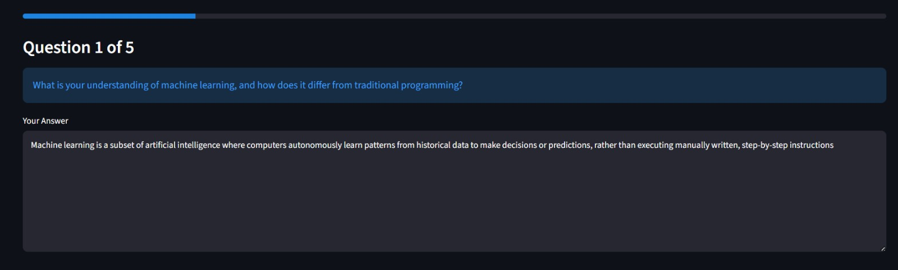
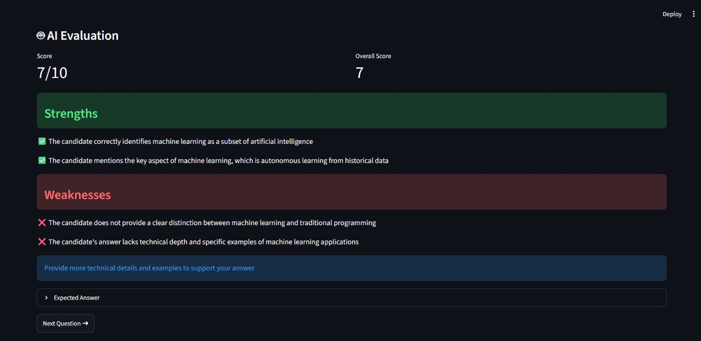
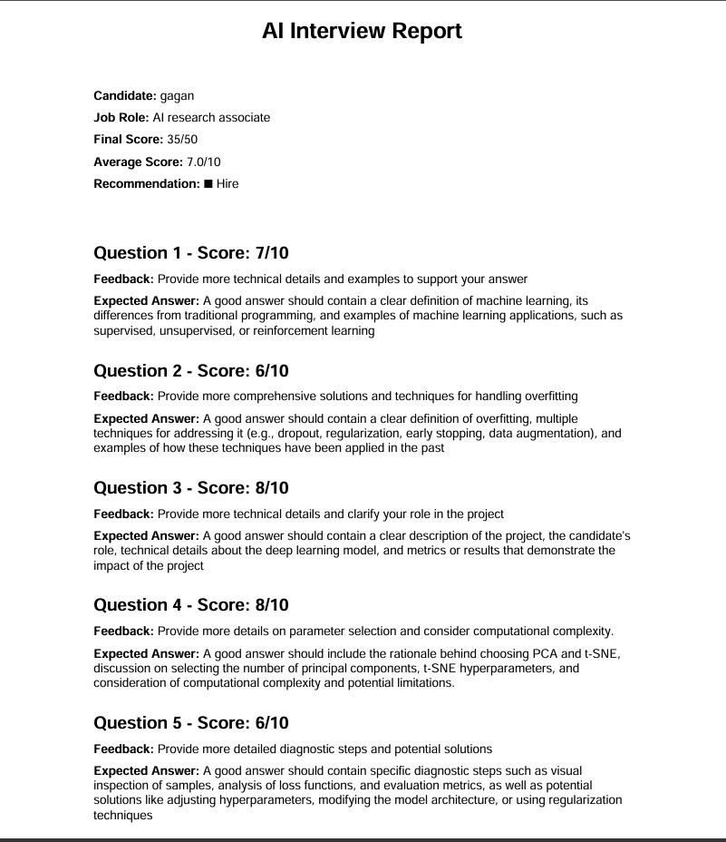

# 🤖 AI Interview Agent using LLMs

An AI-powered technical interview platform that generates role-specific interview questions, evaluates candidate responses using Large Language Models (LLMs), and provides an intelligent interview assessment report with hiring recommendations.

Developed as part of the **Rooman Technologies - Junior AI Research Associate AI Agent Challenge**.

---

## 🚀 Features

- 🎯 AI-generated role-specific interview questions
- 💬 Interactive interview flow (one question at a time)
- 🧠 LLM-powered answer evaluation using Groq Llama 3.3
- 📊 Question-wise scoring (0–10)
- ✅ Strengths and Weaknesses analysis
- 💡 Personalized AI feedback
- 📚 Expected answer suggestions
- 📈 Overall interview score calculation
- 🎯 Hiring recommendation (Strong Hire / Hire / Borderline / Reject)
- 📄 Downloadable PDF interview report
- 📁 JSON interview report export
- 🌐 Interactive Streamlit web interface

---

# 🏗️ Project Architecture

```
AI-Interview-Agent/
│
├── agents/
│   ├── question_generator.py
│   ├── evaluator.py
│   └── summary.py
│
├── utils/
│   ├── prompts.py
│   └── pdf_report.py
│
├── reports/
│
├── app.py
├── requirements.txt
├── README.md
└── .env
```

---

# 🛠️ Tech Stack

| Technology | Purpose |
|------------|---------|
| Python | Backend Development |
| Streamlit | Web Application |
| Groq API | LLM Inference |
| Llama 3.3 70B | Interview Question Generation & Evaluation |
| ReportLab | PDF Report Generation |
| JSON | Interview Report Export |

---

# ⚙️ Installation

## Clone the Repository

```bash
git clone https://github.com/yourusername/AI-Interview-Agent.git
```

```bash
cd AI-Interview-Agent
```

---

## Create Virtual Environment

### Windows

```bash
python -m venv venv
```

Activate

```bash
venv\Scripts\activate
```

---

## Install Dependencies

```bash
pip install -r requirements.txt
```

---

## Configure Environment Variables

Create a `.env` file.

```env
GROQ_API_KEY=YOUR_GROQ_API_KEY
```

---

# ▶️ Run the Application

```bash
streamlit run app.py
```

---

# 📸 Application Screenshots

## 1️⃣ Home Screen

Shows candidate details and job role input.


---

## 2️⃣ Interview Question

Role-specific AI-generated interview questions.



---

## 3️⃣ AI Evaluation

Displays:

- Score
- Strengths
- Weaknesses
- AI Feedback
- Expected Answer



---

## 4️⃣ Final Interview Report

Displays:

- Final Score
- Average Score
- Hiring Recommendation
- Question-wise Evaluation


---

## 5️⃣ PDF Report

Generated downloadable interview report.



---

# 🔄 Workflow

```
Candidate Details
        │
        ▼
Generate Questions
        │
        ▼
Answer Question
        │
        ▼
AI Evaluation
        │
        ▼
Next Question
        │
        ▼
Interview Summary
        │
        ▼
Generate PDF Report
```

---

# 📊 AI Evaluation Metrics

Each answer is evaluated based on:

- Technical Accuracy
- Conceptual Understanding
- Completeness
- Missing Concepts
- Communication Quality

The AI then generates:

- Overall Score
- Strengths
- Weaknesses
- Feedback
- Expected Answer

---

# 📁 Output

The application generates:

- JSON Interview Report
- PDF Interview Report
- Hiring Recommendation

---

# 🔮 Future Enhancements

- 🎤 Voice-based Interview
- 📄 Resume Upload
- 🧠 Resume-based Question Generation
- 🌍 Multi-language Support
- 📹 Video Interview Integration
- 📊 Interview Analytics Dashboard
- ☁️ Cloud Deployment
- 🔐 User Authentication

---

# 👨‍💻 Author

**Gagan Handral**

Dayananda Sagar College of Engineering

B.E. Computer Science and Business Systems

---

# ⭐ Acknowledgements

- Groq
- Meta Llama 3.3
- Streamlit
- ReportLab

---

# 📜 License

This project was developed for educational and recruitment assessment purposes.